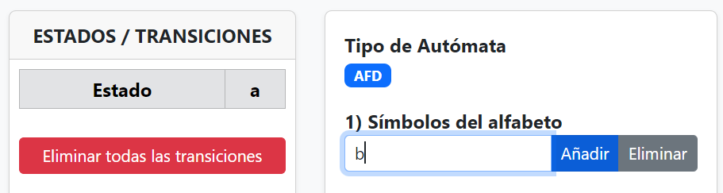
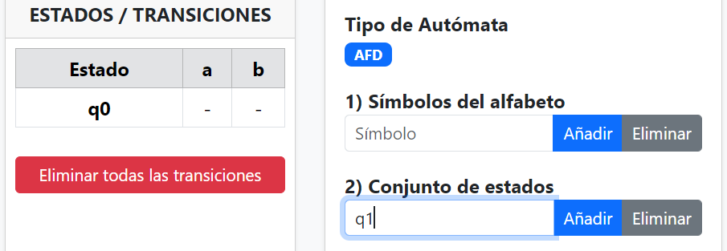
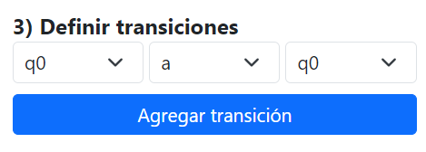
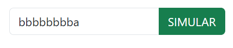
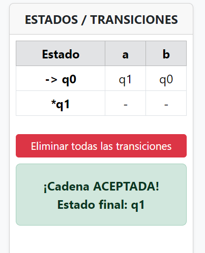

# MANUAL DE USUARIO
# SIMULADOR DE AUTÓMATA FINITO DETERMINISTA (AFD)

**Versión del Documento:** 1.1
**Fecha:** 23 de Noviembre de 2025
**Autores:** Stevenson Arias, Johander Sarmiento

---

**TABLA DE CONTENIDOS**

1. Introducción
    1.1 Propósito
    1.2 Alcance
    1.3 Audiencia Objetivo
2. Descripción General del Sistema
    2.1 Interfaz Gráfica de Usuario (GUI)
3. Requisitos e Instalación
    3.1 Requisitos del Sistema
    3.2 Ejecución del Software
4. Instrucciones de Operación
    4.1 Flujo de Trabajo Recomendado
    4.2 Gestión del Alfabeto
    4.3 Gestión de Estados
    4.4 Configuración del Autómata
    4.5 Definición de Transiciones
    4.6 Simulación de Cadenas
    4.7 Herramientas de Reinicio
5. Solución de Problemas

---

## 1. INTRODUCCIÓN

### 1.1 Propósito
Este documento sirve como guía de referencia y operación para el software "Simulador de Autómata Finito Determinista (AFD)". Proporciona instrucciones detalladas sobre cómo diseñar, configurar y simular el comportamiento de AFD utilizando la interfaz gráfica proporcionada.

### 1.2 Alcance
El software permite la definición formal de una quíntupla de AFD ($Q$, $\Sigma$, $\delta$, $q_0$, $F$) mediante herramientas visuales. Incluye la capacidad de visualizar el autómata como un grafo dirigido, una tabla de transiciones, y validar cadenas de entrada mediante simulación animada.

### 1.3 Audiencia Objetivo
Este manual está destinado a estudiantes de ingeniería, ciencias de la computación y profesionales interesados en la teoría de autómatas y lenguajes formales.

---

## 2. DESCRIPCIÓN GENERAL DEL SISTEMA

El sistema se presenta a través de una Interfaz Gráfica de Usuario (GUI) de ventana única, dividida funcionalmente en dos áreas principales.

### 2.1 Interfaz Gráfica de Usuario (GUI)

El área de trabajo se presenta en una sola ventana dividida verticalmente en tres paneles funcionales:

1.  **Panel Izquierdo (Tabla de Transiciones):**
    Muestra una representación tabular dinámica de la función de transición ($\delta$). Las filas representan los estados ($Q$) y las columnas los símbolos del alfabeto ($\Sigma$). La celda en la intersección indica el estado destino resultante. Además, incluye un botón para eliminar todas las transiciones existentes.

2.  **Panel Central (Configuración y Simulación):**
    Es el área principal de interacción, organizada secuencialmente para guiar el diseño del autómata:
    * **Tipo de Autómata:** Indica el modo actual (AFD).
    * **1) Símbolos del alfabeto:** Herramientas para añadir y eliminar los símbolos permitidos ($\Sigma$).
    * **2) Conjunto de estados:** Herramientas para añadir y eliminar los estados del sistema ($Q$).
    * **3) Definir transiciones:** Interfaz para crear las reglas de movimiento entre estados ($\delta$).
    * **4) Estado inicial:** Selección del punto de partida del autómata ($q_0$).
    * **5) Estados finales:** Selección múltiple de los estados de aceptación ($F$).
    * **Área de Simulación:** Campo de entrada para la cadena a probar y el botón "SIMULAR".

3.  **Panel Derecho (Visualización del Grafo):**
    Ofrece una representación gráfica e interactiva del autómata.
    * **Estados:** Representados como nodos circulares (los finales con doble borde).
    * **Transiciones:** Representadas como aristas dirigidas (flechas) etiquetadas con los símbolos.
    * **Estado Inicial:** Indicado por una flecha entrante sin nodo de origen.
    * Durante la simulación, este panel muestra la animación del recorrido paso a paso.

      

> `[Figura 2.1: Vista general de la interfaz gráfica del Simulador AFD con sus áreas principales identificadas]` 

---

## 3. REQUISITOS E INSTALACIÓN

### 3.1 Requisitos del Sistema
El software es una aplicación de escritorio multiplataforma construida sobre Electron.

* **Sistema Operativo:** Windows 10/11 (64-bit), macOS 10.13+, o distribuciones Linux modernas (Ubuntu, Fedora, etc.).
* **Memoria:** Mínimo 4 GB de RAM.
* **Almacenamiento:** Aproximadamente 300 MB de espacio libre en disco.

### 3.2 Instalación y Ejecución del Software

El procedimiento para iniciar la aplicación varía dependiendo del sistema operativo utilizado.

**Para Windows:**
El archivo proporcionado es un instalador ejecutable (ej. `Simulador AFD Setup 1.0.0.exe`).
1.  Descargue y localice el archivo instalador `.exe`.
2.  Haga doble clic sobre él para iniciar el asistente de instalación.
3.  Siga las instrucciones en pantalla. El instalador copiará los archivos necesarios y creará accesos directos.
4.  Una vez finalizado, inicie la aplicación desde el menú de Inicio o el acceso directo del escritorio.

**Para macOS:**
El archivo proporcionado es una imagen de disco (`.dmg`).
1.  Descargue y localice el archivo `.dmg`.
2.  Haga doble clic para abrir la imagen de disco.
3.  En la ventana que aparece, arrastre el icono de la aplicación "Simulador AFD" a la carpeta de "Aplicaciones".
4.  Una vez copiada, puede ejecutar la aplicación desde el Launchpad o directamente desde la carpeta Aplicaciones.

**Para Linux:**
El archivo proporcionado es un ejecutable portable (`.AppImage`) que no requiere instalación formal.
1.  Descargue y localice el archivo `.AppImage`.
2.  Antes de ejecutarlo por primera vez, asegúrese de darle permisos de ejecución:
    * *Método gráfico:* Clic derecho en el archivo → Propiedades → Pestaña "Permisos" → Marque la casilla "Permitir ejecutar este archivo como un programa".
    * *Método terminal:* `chmod +x Simulador-AFD.AppImage`
3.  Haga doble clic en el archivo para iniciar la aplicación inmediatamente.

---

## 4. INSTRUCCIONES DE OPERACIÓN

Esta sección detalla los procedimientos paso a paso para la operación correcta del simulador.

### 4.1 Flujo de Trabajo Recomendado
Para garantizar la integridad del autómata, se sugiere seguir la siguiente secuencia lógica de configuración:
1.  Definición del Alfabeto ($\Sigma$).
2.  Creación de los Estados ($Q$).
3.  Creación de Transiciones ($\delta$).
4.  Configuración del Estado Inicial ($q_0$) y Estados Finales ($F$).
5.  Ejecución de Simulaciones.

### 4.2 Gestión del Alfabeto
El alfabeto define el conjunto finito de símbolos de entrada permitidos.

**Procedimiento:**
1.  Diríjase al **Panel Central** y ubique la sección **1) Símbolos del alfabeto**.
2.  En el campo de texto, ingrese un único carácter que representará el símbolo (ej. 'a', 'b', '0', '1').
3.  Haga clic en el botón **[Añadir]**. El símbolo aparecerá en la lista justo debajo.

    

> `[Figura 4.1: Sección del panel central mostrando la adición de símbolos al alfabeto]`

4.  Para eliminar un símbolo, escriba el Símbolo y haga clic en el botón **[Eliminar]**.
    > **Nota:** El sistema solo acepta símbolos de longitud 1.

### 4.3 Gestión de Estados
Define el conjunto finito de estados del autómata.

**Procedimiento:**
1.  En el **Panel Central**, ubique la sección **2) Conjunto de estados**.
2.  Ingrese un identificador alfanumérico único para el estado (ej. "q0", "q1", "A", "B").
3.  Haga clic en el botón **[Añadir]**.
4.  Verifique que el nuevo nodo aparezca inmediatamente en el área del grafo en el **Panel Derecho**.

    

> `[Figura 4.2: Creación de estados 'q0' y 'q1' en el panel central y su aparición en el grafo del panel derecho]`

5.  Para eliminar un estado, escriba el identificador y haga clic en el botón **[Eliminar]**.
    > **Advertencia:** La eliminación de un estado conlleva la eliminación automática de todas las transiciones entrantes y salientes asociadas a dicho estado.

### 4.4 Definición de Transiciones
Define la función de transición $\delta: Q \times \Sigma \to Q$.

**Requisitos previos:** Deben existir al menos dos estados y un símbolo en el alfabeto.

**Procedimiento:**
1.  En el **Panel Central**, ubique la sección **3) Definir transiciones**.
2.  Seleccione los componentes de la transición utilizando las listas desplegables:
    * **Origen:** Estado actual del autómata.
    * **Símbolo:** Símbolo de entrada que desencadena la transición.
    * **Destino:** Estado resultante después de leer el símbolo.
3.  Haga clic en el botón **[Agregar transición]**.
4.  Verifique que una nueva arista etiquetada aparece en el grafo (**Panel Derecho**) y una nueva entrada se registra en la Tabla de Transiciones (**Panel Izquierdo**).

    

> `[Figura 4.3: Proceso de creación de una transición y su actualización en el grafo y la tabla izquierda]`

### 4.5 Configuración del Autómata
Este módulo define el estado inicial ($q_0$) y el conjunto de estados de aceptación ($F$).

**Procedimiento para Estado Inicial:**
1.  En el **Panel Central**, diríjase a la sección **4) Estado inicial**.
2.  Seleccione el estado deseado de la lista desplegable.
3.  En el grafo, el nodo seleccionado será señalado por una flecha entrante sin origen.

**Procedimiento para Estados Finales:**
1.  En el **Panel Central**, diríjase a la sección **5) Estados finales**.
2.  En la lista de selección múltiple, haga clic en los estados que se considerarán de aceptación.
    * *Uso de Teclado:* Mantenga presionada la tecla `Ctrl` (Windows/Linux) o `Cmd` (macOS) para seleccionar múltiples estados.
3.  En el grafo, los nodos seleccionados se actualizarán visualmente con un borde doble.

    

> `[Figura 4.4: Configuración de estado inicial y estados finales en el panel central con su reflejo visual en el grafo]`

### 4.6 Simulación de Cadenas
Este módulo permite verificar la aceptación o rechazo de una cadena de entrada específica por el autómata definido.

**Requisitos previos:** El autómata debe tener definido un Estado Inicial ($q_0$).

**Procedimiento:**
1.  Ubique el área de **Simulación** en la parte inferior del **Panel Central**.
2.  En el campo de entrada, escriba la secuencia de símbolos a probar (ej. "aba", "1101").
3.  Haga clic en el botón **[SIMULAR]**.

    

> `[Figura 4.5: Área de simulación en el panel central mostrando una cadena de entrada]`

**Interpretación de Resultados:**
* **Animación Visual:** El sistema ejecutará una animación paso a paso en el grafo del **Panel Derecho**. El estado activo se resaltará en amarillo.
* **Veredicto:** Al finalizar el procesamiento, el sistema mostrará un mensaje de estado debajo del botón **[Eliminar TODAS las Transiciones]**.

    

> `[Figura 4.6: Ejemplo de resultado de simulación exitosa (Cadena Aceptada) y fallida (Cadena Rechazada)]`

### 4.7 Herramientas de Reinicio
El sistema proporciona una función para reestablecer rápidamente la lógica del autómata.

**Procedimiento:**
1.  Ubique el botón rojo **[Eliminar TODAS las Transiciones]** en la parte inferior del **Panel Izquierdo** (debajo de la tabla).
2.  Haga clic y confirme la acción en el cuadro de diálogo emergente. Todas las aristas del grafo y los datos de la tabla serán depurados.

---

## 5. SOLUCIÓN DE PROBLEMAS

La siguiente tabla resume los problemas operativos comunes y sus soluciones.

| ID | Síntoma/Error | Causa Probable | Acción Correctiva |
| :--- | :--- | :--- | :--- |
| **E1** | No es posible agregar una transición; las listas desplegables están vacías. | No se han definido estados ($Q$) o símbolos del alfabeto ($\Sigma$) previamente. | Complete los procedimientos descritos en las secciones 4.2 y 4.3 antes de intentar crear transiciones. |
| **E2** | Mensaje de error: "No se ha definido estado inicial" al intentar simular. | La configuración del autómata está incompleta. | Diríjase al panel "Configuración del Autómata" y seleccione un estado inicial válido (ver sección 4.4). |
| **E3** | Mensaje de error indicando que un símbolo "no pertenece al alfabeto" durante la simulación. | La cadena de entrada contiene caracteres no definidos en $\Sigma$. | Verifique que la cadena ingresada solo contenga caracteres que hayan sido añadidos previamente en el panel "Gestión del Alfabeto". |
| **E4** | La visualización del grafo es confusa debido al cruce excesivo de aristas. | Complejidad del autómata o disposición automática subóptima. | Los nodos del grafo son interactivos. Arrastre y suelte los nodos manualmente para reorganizar la visualización según sea necesario. |

---
**Fin del Documento**