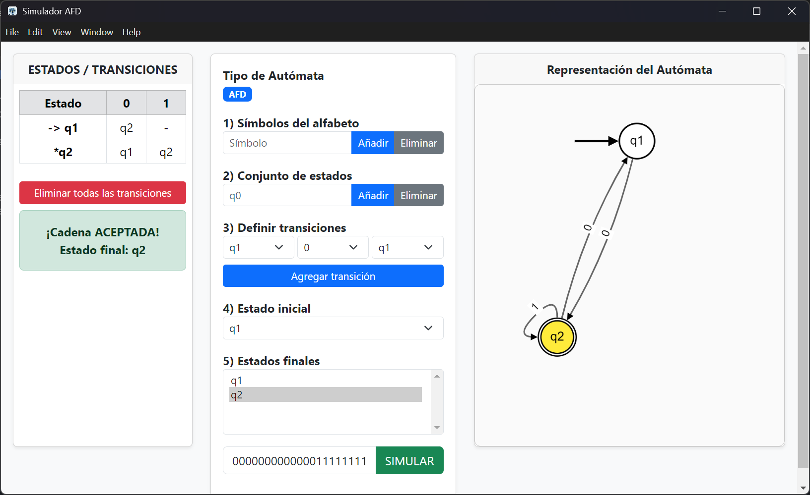

# 🤖 Simulador de Autómata Finito Determinista (AFD)

Una aplicación de escritorio moderna e interactiva construida con **Electron** para diseñar, visualizar y simular Autómatas Finitos Deterministas (AFD).
Permite crear estados, definir alfabetos, establecer transiciones y ejecutar cadenas mientras observas la animación del recorrido paso a paso.

---

## 📸 Captura del Proyecto

```md

```

## ✨ Características Principales

* **Diseño Intuitivo de Autómatas**

  * Agregar y eliminar estados con facilidad.
  * Estado inicial marcado con flecha `→`.
  * Estados finales con doble círculo.
* **Gestión del Alfabeto**

  * Añadir y eliminar símbolos válidos.
* **Definición de Transiciones**

  * Crear conexiones entre estados mediante el alfabeto definido.
* **Visualización Interactiva con Cytoscape.js**

  * Layout automático y limpio.
  * Detección dinámica de transiciones.
  * Flecha de estado inicial estilizada.
* **Simulación Paso a Paso**

  * Se ilumina cada estado recorrido.
  * Muestra la transición seleccionada en tiempo real.
  * Resultado visual de aceptación o rechazo.
* **Tabla de Transiciones Dinámica**
* **Botón para reiniciar todas las transiciones**

---

## 🛠️ Tecnologías Utilizadas

* **Electron** (v31+)
* **Node.js**
* **HTML5, CSS3, JavaScript ES6+**
* **Bootstrap 5** (local)
* **Cytoscape.js** (local)
* **electron-builder**

---

## 📋 Requisitos Previos

Instalar:

* Node.js (LTS recomendado)
* npm (incluido con Node)

---

## 🚀 Instalación y Uso

1. **Clonar el repositorio**

```bash
git clone <URL_DE_TU_REPOSITORIO>
cd simulador-afd
```

2. **Instalar dependencias**

```bash
npm install
```

> Bootstrap y Cytoscape ya están incluidos localmente.

3. **Ejecutar el simulador**

```bash
npm start
```

---

## 📂 Estructura del Proyecto

```text
simulador-afd/
│
├── build/                     # Archivos para empaquetado
├── dist/                      # Ejecutables generados
│
├── main.js                    # Proceso principal de Electron
├── preload.js                 # ContextBridge seguro
├── package.json               # Scripts y metadatos
│
└── src/
    ├── index.html             # Interfaz principal
    ├── assets/
    │   ├── css/               # Bootstrap + estilos propios
    │   ├── img/               # Capturas e iconos
    │   └── js/
    │       ├── afd.js         # Lógica interna del autómata
    │       ├── cytoscape.min.js
    │       ├── draw.js        # Dibujado de nodos y animación
    │       └── ui.js          # Controlador del DOM y eventos
```

---

## 📦 Empaquetado

Generar ejecutables:

```bash
npm run dist
```

Por plataforma:

```bash
npm run dist:win
npm run dist:mac
npm run dist:linux
```

---

## 👥 Autores

* **Stevenson Arias** (https://github.com/Jorkaed)
* **Johander Sarmiento**

---

## 📄 Licencia

Este proyecto está bajo la **Licencia MIT**.
Consulta el archivo `LICENSE` para más detalles.

---